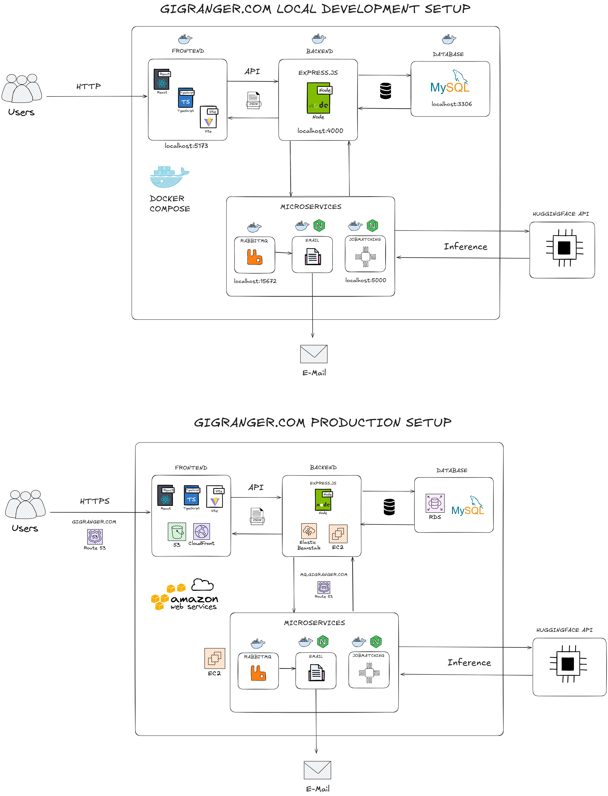

## gigranger.com - A Employment Platform🧑‍💼

A full-featured job portal application that allows **recruiters** to post and manage job listings, and **job seekers** to find, apply, and track job applications — with a seamless real-time chat system connecting them.

This project showcases real-world, production-ready features such as:

- 🔐 **Authentication and role-based access**

- 📄 **Resume uploads with automatic S3/local detection**

- 📬 **Email notifications via RabbitMQ-based microservice**

- 🧠 **AI-powered resume-to-job matching using Hugging Face**

- 🗂️ **Application status tracking with history and comments**

- 🔎 **Filtering, pagination, and admin-level CRUD operations**

- 💬 **Live chat with offline message sync and unread badges**

- 🌐 **Multilingual support with 10 languages via i18next**

The backend leverages a **modular microservices architecture** for improved scalability:

- Email notifications are offloaded to a dedicated **RabbitMQ-powered email microservice**.

- Resume-job matching is powered by a standalone **LLM-based microservice**, deployed securely and independently.

These design choices decouple long-running or compute-heavy tasks from the main app, improving responsiveness and enabling future scalability.

## 🧩 Installation Guide

You can now run the entire application using Docker without needing to install Node.js, MySQL, or any local dependencies — everything runs in containers.

1.  **Clone the Repository**

> git clone https://github.com/alexismreyes/gigranger.com.git <br>

> cd gigranger.com

2. **Configure Environment Files**

Create the following `.env` files for your local development environment:

- `./backend/.env.development`
- `./frontend/.env.development`
- `./email-service/.env`
- `./jobmatching-service/.env`

Use the sample variables listed in the [🔐 Environment Variables](#-environment-variables) section to fill out each file correctly.

> ⚠️ **Important Notes:**
>
> - Use a real email address to receive application notifications. All preloaded users in the database use the password `123456789`.
> - Use the MySQL username and password defined in the `/database/init.sql` file, or set your own credentials — just ensure they match across all relevant `.env` files.
> - The `jobmatching-service` requires proper API access to Hugging Face so you need to request yours at the huggingface site https://huggingface.co and use it at the .evn file from the /jobmatching-service folder
>   <br><br>

3.  **Run the App Using Docker**

_🐧 For Linux/macOS:_

Use the provided Makefile:

make run # Start all containers

make stop # Stop containers (keep data)

make reset # Remove everything and reinitialize from SQL dump

make rebuild # Full clean + rebuild + launch

_🪟 For Windows:_

Use the interactive script:

manage.bat

This script will show a menu with options to run, stop, reset, or rebuild the app using Docker Compose.

### Notes on Database Initialization

- The database will be automatically created and seeded using the included `employment_db.sql` file included within the database folder.

- You do **not** need to import the SQL file manually.

- Data is persisted across runs using Docker volumes depending the option you choose from the make file or manage.bat file.

- Running a full reset (`make reset` or option 3 in `manage.bat`) will wipe all data and reload the schema from `employment_db.sql`.

## 🔐 Environment Variables

**_Backend .env.development_**

PORT=4000

DB_HOST=gigranger-database-service

DB_NAME=employment_db

DB_USER=gigranger_user #DB user

DB_PASS=gigranger_user_pass #DB password

JWT_SECRET=your_jwt_secret

EMAIL_USER=your_email@example.com #The main email account from which app will send the emails

EMAIL_PASS=your_email_password #The password from that main email account

FRONTEND_URL=http://localhost:5173

NODE_ENV=development

ALLOWED_ORIGINS=http://localhost:5173 #Add multiple allowed origins as needed comma separated

RABBITMQ_DEFAULT_USER=rabbitmq_user #user for rabbitmq - you may use your own

RABBITMQ_DEFAULT_PASS=rabbitmq_pass #password for rabbitmq - you may use your own

RABBITMQ_HOST=rabbitmq

JOBMATCHINGSERVICEURL=http://gigranger-jobmatching:5000/jobmatching #running inside a container

<br>

**_Frontend .env.development_**

VITE_API_URL=http://localhost:4000/api/v1

VITE_SOCKET_URL=http://localhost:4000

<br>

**_Email-service microservice .env_**

EMAIL_USER=your_email@example.com #The main email account from which app will send the emails

EMAIL_PASS=your_email_password #The password from that main email account

RABBITMQ_DEFAULT_USER=rabbitmq_user

RABBITMQ_DEFAULT_PASS=rabbitmq_pass

RABBITMQ_HOST=rabbitmq

<br>

**_Job matching microservice .env_**

HUGGINGFACE*API_KEY=\_YOUR_HUGGINGFACE_API_KEY*

MODEL_URL=https://api-inference.huggingface.co/models/MoritzLaurer/DeBERTa-v3-base-mnli-fever-anli

PORT=5000

<br>



## 🐳 Dockerized Microservices

As of the latest version, the app has been modularized using a microservices approach. Three new containers have been added, one dedicated to RabbitMQ message broker, another one Node.js email microservice container plus one more node container holding the job matching microservice:

| Container Name | Description |

| ------------------------- | --------------------------------------------------------------------------------------------- |

| `gigranger-frontend` | React frontend |

| `gigranger-backend` | Node.js + Express backend API |

| `gigranger-database` | MySQL instance with init + seed |

| `rabbitmq` | RabbitMQ message broker with management UI |

| `gigranger-email-service` | Node-based microservice that processes queued email jobs |

| `gigranger-jobmatching` | Node-based microservice that uses a Hugging Face model to analyze resume-to-job compatibility |

These containers are orchestrated using Docker Compose. All communication between services (e.g., backend → RabbitMQ → email-service) is handled asynchronously.

## 🚀 Features

👥 **Authentication & Authorization**

- JWT-based login & registration

- Email verification for new users

- Role-based access (Admin, Recruiter, Job Seeker)

- Route protection with dynamic rendering based on user role

🡳 **Recruiter Functionality**

- Create, update, and delete company profiles

- Post job listings with detailed descriptions

- Track job applications submitted to their jobs

- Update application statuses with comments (hiring pipeline)

- Receive email notifications when a candidate applies

🡩‍🎓 **Job Seeker Functionality**

- View available jobs and filter by category, company, or keyword

- Submit job applications with resume uploads

- Track application status with detailed history

- Receive email notifications on status updates

📄 **File Handling**

- Resume upload with file storage via Multer

- View resumes directly from job applications list

📬 Notifications

- Email alerts are handled by a dedicated `gigranger-email-service` microservice.

- Messages are published to a RabbitMQ queue by the backend and processed asynchronously.

- Uses Nodemailer to send notifications to both recruiters and applicants.

💬 **Real-Time Chat System**

This app features a **floating real-time chat system** powered by **WebSockets (Socket.IO)**, allowing recruiters and job seekers to communicate instantly — even across different sessions.

_✨ Key Features_

- Floating Chat Window: Opens as a modal for smooth access from anywhere in the app.

- Notification Badges: Displays the count of unread messages across chat rooms, even when the user is offline.

- Offline Message Sync: Messages sent while a user is logged out are tracked and displayed with a badge upon next login.

- Read Status: Messages are marked as read when the chat window is opened.

- Dynamic Chat Rooms: Created automatically based on job application interactions (1:1 between recruiter and job seeker).

📊 **User Interface**

- Responsive layout using **Material UI**

- Intuitive admin panel with Drawer navigation, modals, tables, and pagination

- Inline feedback using Snackbars and confirmation dialogs

📄 **Resume Upload Feature**

This project includes a file upload functionality for user resumes, which supports **both local storage (for development)** and **Amazon S3 storage (for production)**.

**🔎 AI-Powered Job Matching Microservice**

This app includes a resume-to-job matching microservice using a Hugging Face-hosted LLM to find the most relevant job listings based on the content of your resume.

⚙️ Backend reads resumes (from S3 in production or disk locally), extracts their text with pdf-parse, and calls the AI service.

🤖 Job descriptions are passed to a Hugging Face model for zero-shot classification. (previously we used facebook/bart-large-mnli but due to some model downtimes we now changed to MoritzLaurer/DeBERTa-v3-base-mnli-fever-anli which is always hosted in huggingfaces)

📊 Results are scored and color-coded based on compatibility percentage.

⚙️ **Admin Functionality**

- Full CRUD for users, companies, jobs, categories, statuses

- Filter and search functionality for easier record management

🌐 \*\*Multilingual Support

Gigranger now supports a total of **10 languages** to offer a more inclusive and global user experience. The multilingual implementation was achieved using the [`i18next`](https://www.i18next.com/) internationalization library, integrated with `react-i18next` for seamless support across the React frontend.

### Supported Languages:

- **English** (default)
- **Español** (Spanish)
- **Français** (French)
- **Deutsch** (German)
- **Português** (Portuguese)
- **हिन्दी** (Hindi)
- **Русский** (Russian)
- **中文 (简体)** (Chinese - Simplified)
- **日本語** (Japanese)
- **العربية** (Arabic)

### Implementation Details:

- Language files are stored in `src/i18n/locales/{language}/translation.json`.
- Language switching is handled via a `<Select>` dropdown menu in the app header.
- Translations cover the whole UI elements as well as most of the errors received from the backend to be used for the snackbar component for user feedback.

  The translation system is fully scalable, allowing new languages to be added by simply extending the translation files and configuration.

## 💠 Tech Stack

| Layer | Technology |

| -------------------- | ---------------------------------------------------------------------------------------------------- |

| **Frontend** | React + Vite, TypeScript, Material UI, Axios |

| **Backend** | Node.js, Express, Sequelize ORM, Multer, JWT, WebSockets |

| **Database** | MySQL (AWS RDS or Dockerized locally) |

| **Messaging Queue** | RabbitMQ (used for decoupled email notification microservice) |

| **Authentication** | JWT + Bcrypt, Context API |

| **Containerization** | Docker, Docker Compose |

| **Deployment** | S3 + CloudFront (frontend), Elastic Beanstalk (backend), RDS (MySQL), EC2 (RabbitMQ & Email Service & Job Matching Service) |

| **Dev Tools** | Postman, Jest, Supertest, ESLint, Prettier |

## 🧪 Testing & Authentication

- Backend tested with Jest and Supertest

- Token validation and protected routes tested with mock JWTs

- Services and context logic covered with custom hooks and mock APIs

## 🌐 Current Deployment

You can try out the app here:

🔗 [https://gigranger.com](https://gigranger.com) — Main frontend

🔗 [https://api.gigranger.com](https://api.gigranger.com) — Backend API

---

## ✅ Deployment Stack

| Component | Details |

| --------------------------- | -------------------------------------------------------------------------------------------------------------------------------------------------------------- |

| **Frontend** | React app hosted on AWS S3 and served via CloudFront with custom domain and HTTPS (`gigranger.com`) |

| **Subdomain Redirect** | `www.gigranger.com` redirects to the root domain using S3 redirect + CloudFront |

| **Backend API** | Node.js + Express app deployed to Elastic Beanstalk (single-instance, no load balancer), reverse-proxied with Nginx + Let's Encrypt SSL at `api.gigranger.com` |

| **Database** | AWS RDS using MySQL |

| **EC2-Based Microservices** | **RabbitMQ**, **the email service** and **the job matching service** run on a dedicated AWS EC2 instance using Docker Compose for persistent, external communication |

<br>

## 📄 Resume Upload Feature Details

As mentioned above, this project includes a file upload functionality for user resumes, which supports **both local storage (for development)** and **Amazon S3 storage (for production)**.

### 🔁 Automatic Storage Mode Detection

The app automatically switches between **local disk storage** and **S3 cloud storage** depending on the environment configuration:

| Environment | Storage Method | Trigger |

| ----------- | ---------------------- | ------------------------------------- |

| Development | Local (project folder) | No `S3_BUCKET_NAME` defined in `.env` |

| Production | Amazon S3 | `S3_BUCKET_NAME` is defined in `.env` |

### 📂 Local Storage (Development)

- Files are saved under:

`backend/uploads/resumes/`

- Ensure the following line is active in `app.js`:

```js
app.use(
  '/uploads/resumes',

  express.static(path.join(__dirname, 'uploads/resumes'))
);
```

### ☁️ Amazon S3 Storage (Production)

When the application is deployed in production and the environment is properly configured, resumes are uploaded to **Amazon S3** instead of being stored locally.

- Files are saved inside the `resumes/` folder within your S3 bucket.

- The uploaded file is publicly accessible using the returned S3 URL.

- Example of a stored file URL:

`https://gigranger.com/resumes/1745539929008-customerserviceresume.pdf`

To enable S3 uploads, ensure the following environment variables are defined in your `.env.production`:

| Variable | Description |

| ----------------------- | ------------------------------ |

| `AWS_ACCESS_KEY_ID` | Your AWS access key |

| `AWS_SECRET_ACCESS_KEY` | Your AWS secret access key |

| `AWS_REGION` | AWS region (e.g., `us-east-2`) |

| `S3_BUCKET_NAME` | Your S3 bucket name |

If any of these are missing, the app will **automatically fallback to local storage**.

## 📦 Frontend Architecture

The frontend follows a **Component-Driven Development (CDD)** approach, emphasizing separation of concerns:

- **Services** handle all API communication (e.g., `JobService`, `AuthService`).

- **Hooks** (e.g., `useJobCategories`, `useAuth`) encapsulate logic and data fetching.

- **Components** like tables, dialogs, and form inputs focus on UI rendering.

- **Pages** use these building blocks to compose full features.

This modular pattern improves reusability, testing, and clarity across the UI codebase.

## ⚙️ Backend Architecture

The backend is structured following Modular API Design principles using Express and Sequelize. This design allows for scalability, separation of concerns, and maintainability.

- **Controllers** handle business logic for each domain (e.g., `authController`, `jobController`, `chatController`).

- **Models** define Sequelize schemas and represent database tables (e.g., `User`, `Job`, `ChatMessage`).

- **Routes** map HTTP endpoints to controller methods (e.g., `jobRoute`, `authRoute`, `chatRoute`).

- **Middlewares** manage authentication, validation, error handling, and other reusable logic (e.g., `verifyToken`).

- **Sockets** enable real-time features like live chat using Socket.IO. Includes logic for joining rooms, broadcasting messages, and notifying users.

- **Utils and Services** provide shared utilities (e.g., file uploads with Multer, email publishing via RabbitMQ, and S3 integration).

- **Microservices**: The backend publishes events (e.g., email notifications) to RabbitMQ, which are consumed by the `gigranger-email-service` running on a separate EC2 instance. This decouples the main app from background job processing. - **Job Matching Microservice**: The backend integrates with a dedicated microservice to evaluate job-resume compatibility using an AI model from Hugging Face. This service runs independently on a Dockerized EC2 instance and is accessed securely via `mq.gigranger.com`. Resume files are parsed from either disk or S3 depending on the environment.

- **Test folder** contains backend unit/integration tests using Jest and Supertest.

This backend structure supports full API lifecycle management — from secure user authentication to real-time communication — and enables scalable feature development through modular services and message-driven architecture.

## 📌 Disclaimer

This app began as a personal initiative to practice and explore full-stack development concepts using modern tools like React, Node.js, MySQL, and AWS. While it may not follow a single strict standard across all components — for instance, some forms use Dialogs while others use Formik, and error handling varies between Axios responses and `console.error` — this was intentional.

The goal has always been to build a progressively enhanced application while experimenting with different patterns, tools, and technologies. As it evolved, I incorporated more real-world features such as file uploads, email notifications, realtime chat, role-based access control, protected routes, and application history.

I plan to continue improving it with technologies like RabbitMQ, Docker Containerization, and more advanced patterns. This app is meant to be a learning-driven, functional foundation of a job portal, reflecting growth, curiosity, and hands-on problem solving.

So don’t judge it by perfection 😄

## 👨‍💼 **Author & Contact**

**Marlon Alexis Manzano Reyes**

Full Stack Developer | React | Node.js | MySQL | Express.js | Typescript

📍 San Salvador, El Salvador

📧 malexismreyes@gmail.com

🌐 https://www.linkedin.com/in/alexismreyes/
